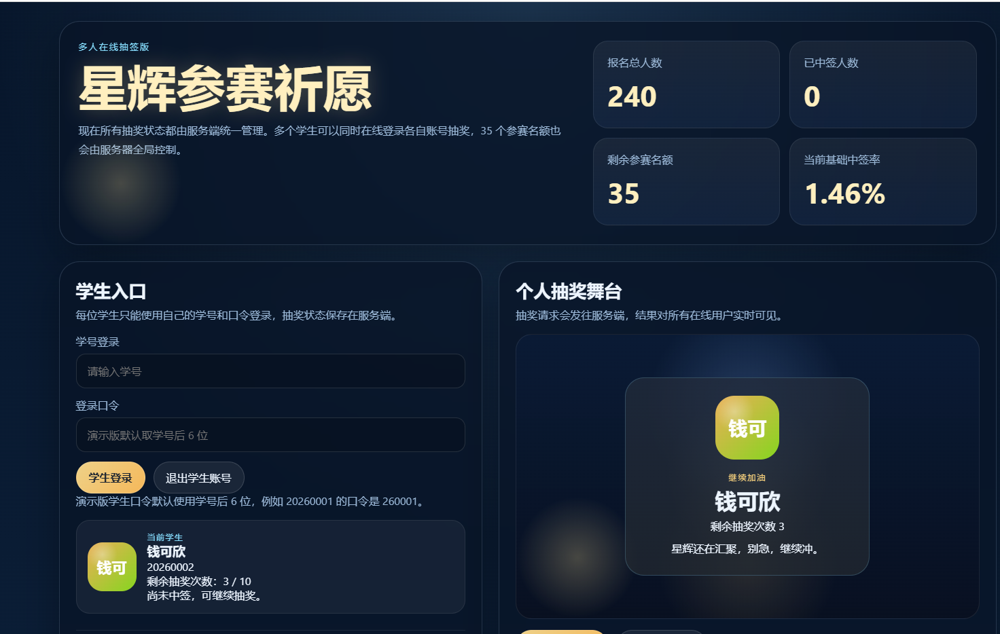
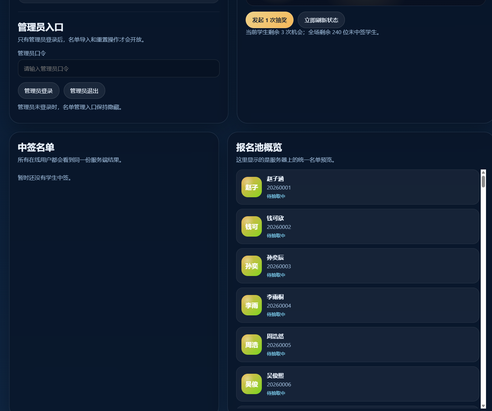

# 星辉参赛祈愿

一个面向校园比赛筛选场景的多人在线抽奖系统，抽奖演出借鉴《原神》抽卡动画的视觉节奏与舞台氛围，强调全屏冲击感、仪式感和现场展示效果。学生使用个人账号登录后可自行抽奖，系统由服务端统一控制动态中奖概率与 35 个参赛名额，兼顾公平性、参与感和视觉震撼力。

## 项目简介

这是一个用于校园比赛报名筛选的在线抽奖系统，目标是在数百名报名学生中动态筛选出 35 位正式参赛选手。

项目最大的特点，是在抽奖体验上借鉴了《原神》抽卡动画的表现方式：通过全屏视频、强烈的明暗变化、结果揭晓节奏和居中高光展示，尽可能营造出具有冲击力和仪式感的抽奖氛围，让学生在参与抽奖时拥有更强的沉浸感和期待感，现场效果更加震撼。

系统支持多人同时在线使用。学生通过个人学号和口令登录后，可在自己的页面中独立发起抽奖；管理员则可以登录后台进行学生名单导入、演示数据初始化和抽奖状态管理。所有抽奖状态、中签名单、剩余名额和动态概率均由服务端统一维护，确保多用户同时在线时依然能够保持结果一致、公平可控，并最终稳定产出 35 位中签选手。

## 功能特性

- 多人在线抽奖：多个学生可同时登录各自账号进行抽奖
- 学生账号隔离：学生仅能使用自己的学号和口令登录
- 管理员权限控制：只有管理员可导入名单、添加学生、重置数据
- 动态中奖概率：基于剩余名额与剩余抽奖次数实时调整
- 全屏抽奖演出：借鉴《原神》抽卡动画节奏，中奖与未中奖均有全屏反馈
- 中奖名单同步：所有在线用户查看的是同一份服务端结果
- 视频结果揭晓：中奖播放出金视频，未中奖播放鼓励视频
- 自动化测试：覆盖核心抽奖规则与关键界面流程

## 页面预览

截图目录建议放在 `docs/screenshots/` 下，例如：

- `docs/screenshots/home.png`
- `docs/screenshots/panel.png`

截图放入仓库后，可以在这里直接展示：

```md


```

## 技术栈

- 前端：Vite + TypeScript
- 后端：Node.js + Express
- 测试：Vitest + Testing Library
- 运行模式：前后端本地联调，前端通过 `/api` 代理访问服务端

## 本地运行

```bash
npm install --registry=https://registry.npmmirror.com/
npm run dev
```

启动后可访问：

- 前端：`http://localhost:4173`
- 后端健康检查：`http://127.0.0.1:4174/api/health`

## 默认演示账号

- 学生账号：示例学号如 `20260001`
- 学生口令：默认取学号后 6 位，例如 `20260001 -> 260001`
- 管理员口令：`admin2026`

## 测试

```bash
npm run test
```

## 构建

```bash
npm run build
```

构建产物输出到 [dist](./dist)。

## 项目结构

- [src/app.ts](./src/app.ts)：前端主界面与交互逻辑
- [src/style.css](./src/style.css)：页面样式与演出效果
- [server.mjs](./server.mjs)：服务端登录、抽奖、名单管理接口
- [src/utils/lottery.ts](./src/utils/lottery.ts)：抽奖规则与工具函数
- [docs/project-plan.md](./docs/project-plan.md)：项目计划
- [docs/prd.md](./docs/prd.md)：产品需求文档

## 说明

- 当前版本为可演示、可继续扩展的多人在线抽奖系统
- `server-db.json` 为本地运行时数据文件，默认不提交到仓库
- `dist` 默认不提交到 Git 仓库，GitHub 上以源码为主
- 抽奖动画为“风格借鉴式”设计，重点体现类似《原神》抽卡的震撼演出感，不直接复刻游戏原始素材
